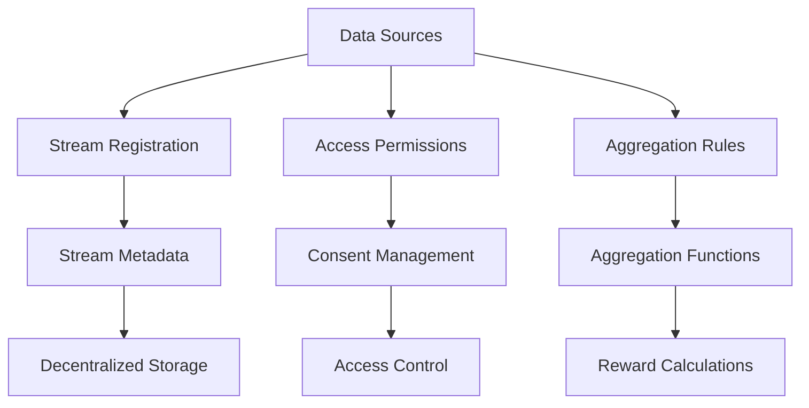

# Aggregator Library

A flexible and secure smart contract library for managing and aggregating decentralized data streams with granular access controls and incentive mechanisms.

## Overview

The Aggregator Library provides a comprehensive framework for:

- Secure data stream management
- Flexible access control mechanisms
- Dynamic data aggregation
- Community-driven contribution models

## Key Features

- Modular data stream registration
- Granular permission management
- Transparent contribution tracking
- Extensible reward systems

## Architecture



## Getting Started

### Prerequisites
- Clarinet
- Stacks Wallet

### Installation

1. Clone the repository
2. Install dependencies:
```bash
clarinet install
```

3. Run tests:
```bash
clarinet test
```

## Usage Examples

### Register a Data Stream
```clarity
(contract-call? .data-aggregator register-stream 
  "temperature" 
  "environmental-sensors")
```

### Grant Access Permission
```clarity
(contract-call? .data-aggregator grant-stream-access 
  RESEARCHER_PRINCIPAL 
  "temperature" 
  u86400)
```

## Development

### Testing
```bash
clarinet test
```

### Local Development
```bash
clarinet console
```

## Security Considerations

- Granular access controls
- Time-bound permissions
- Transparent consent tracking
- Modular design for extensibility

## License

MIT License